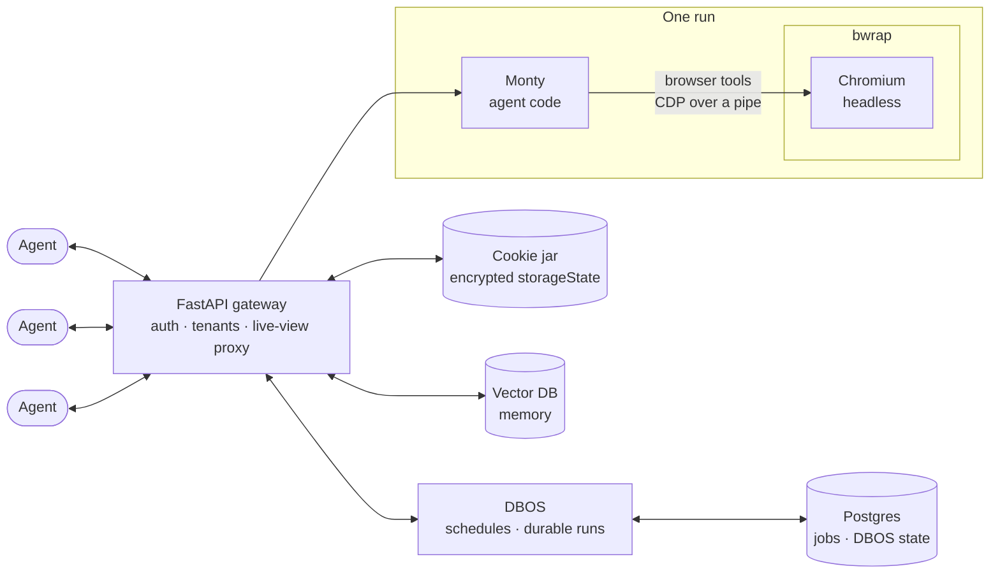

# Sammy design

**Status:** draft, written 2026-10-06 by Claude for Mike. It builds on Aditya's
[2026-10-06 note](<notes/2026-10-06 clai2 vs Muse, Dots and Grok Bot.md>). Pydantic AI and harness facts come from
pydantic-ai `main` at `803d3eb46`, the same commit as that note. Nothing here is built or tested yet, and nothing is
agreed with anyone.

## Goal

Sammy is a service that people's own agents connect to. A user asks their agent for a scheduled browser task:

> Every Tuesday, check my messages for a shopping list, put everything in my walmart.com cart, then ping me.

Sammy runs the task on schedule in a sandbox. When the agent gets stuck on a login, a CAPTCHA or an unclear item,
it hands the browser to the user, who finishes that one step. Then the run continues.

Grok Bot, dots and Muse give every user (or every bot) a cloud computer that runs all the time. Sammy gives
nobody a computer. Between runs, a user costs a few rows in Postgres. During a run, a user costs one Monty session
and one headed Chromium on a private Xvfb display, and both exist only while the run needs them.

## How this relates to the 2026-10-06 note

It agrees with that note on:

- **Monty first.** The agent's code runs in Monty, and Monty reaches the outside world only through host functions.
- **Takeover is an approval with a screen attached.** The agent stops, the user does the blocked step, and the agent
  resumes with a short summary.
- **Live-view links** are short-lived, signed, and issued by our gateway.
- **One writer at a time** per browser profile, including while a human drives.

It differs on purpose:

- **No VM per user.** Logins live in an encrypted cookie jar (Playwright `storageState`) in Postgres, not on a VM's
  disk. A user's files are a plain directory on our server (`WORKSPACES_DIR`), which Monty code sees at `/work` and
  browser downloads land in (#21).
- **No computer use.** There is no E2B desktop and no router choosing between Monty and computer use. Sammy only
  drives a browser. A task that needs a desktop app is out of scope. (Decided 2026-10-06.)
- **People reach Sammy in the chat apps they already use.** (Reversed by #138: this used to say "agents are the
  clients, not chat channels".) Slack, Telegram, WhatsApp and Discord talk to Sammy directly, next to the web and
  Mac apps, through one shared chat layer (below). Each platform is a thin adapter on top of it.
- **DBOS is the durable backend.** That answers the note's open question for this service.

## Components



| Component | Job | Built from |
|---|---|---|
| FastAPI gateway | Auth, tenant scoping, the API agents call, the live-view proxy | FastAPI |
| DBOS | Schedules, durable run workflows, waiting for the user | DBOS on Postgres; Pydantic AI's `DBOSAgent` (`pydantic_ai.durable_exec.dbos`) |
| Monty | Runs the agent's Python. Its only way to the browser is host functions | `pydantic-monty`, harness `CodeMode` |
| Chromium | One per run, headless, inside its own bubblewrap sandbox | Playwright and our own launch script |
| Postgres | Schedules, runs, DBOS workflow state | DBOS system tables plus ours |
| Cookie jar | Each user's `storageState`, encrypted with a key per tenant | A Postgres table and envelope encryption |
| Vector DB | Per-user memory, such as which brand of eggs a user buys | Open: pgvector would keep everything in one database |

FastAPI and DBOS run in the same process, and there are N copies of it. DBOS is a library, so it adds no extra
service.

## A scheduled run, step by step

```
user: "every Tuesday, cart my shopping list"
  └─ user's agent calls create_schedule(cron, task)       gateway -> Postgres
       ... Tuesday 09:00
       └─ @DBOS.scheduled fires on exactly one replica
            ├─ step: load the user's storageState from the cookie jar
            ├─ step: launch Chromium in bwrap with that state
            ├─ step: run the agent; its code runs in Monty and calls browser tools
            │    └─ stuck (login, 2FA, CAPTCHA, payment, unclear item)?
            │         ├─ agent calls ask_user(reason)
            │         ├─ the workflow waits on DBOS.recv("handoff")     survives restarts
            │         ├─ user's agent gets a ping with a signed live-view link
            │         ├─ user drives the same Chromium, clicks "Return control"
            │         └─ gateway calls DBOS.send(workflow_id, ...)  -> the agent resumes with a summary
            ├─ step: save storageState back to the cookie jar
            └─ step: report "cart ready" to the user's agent
```

A live Chromium cannot survive a crash. If a replica dies mid-run, DBOS resumes the workflow on another one, and the
next browser step launches a fresh Chromium from the cookie jar. Steps must tolerate a repeat. For example, check the
cart before adding an item.

## Driving the browser from Monty

Monty cannot start processes or open sockets. Browser actions are host functions. When the agent's code calls one,
Monty pauses, the host runs the function, and Monty resumes with the result. That pause is the hook between Monty and
the browser.

**What exists today:** harness `CodeMode` turns every tool the agent has into a function inside Monty. Harness
`PlaywrightBrowser` provides the browser tools (`navigate`, `click`, `type_text`, `press_key`, `select_option`,
`hover`, `screenshot`, `get_text`, and more), with a domain allowlist (`allowed_domains`) and a block on private
addresses. Together, the agent writes plain Python that drives a real Chromium.

**Later:** a Playwright-shaped `browser` module inside Monty (`page.goto(...)`, `page.fill(...)`). It is a nicer API
over the same hook.

**Never give Monty raw CDP.** The Chrome DevTools Protocol can read every cookie, download files, and close the
browser. Monty gets a fixed list of browser actions, nothing more.

**Rejected: building a browser into Monty.** Monty is safe because it is small and has no I/O. A browser is millions
of lines of native code running JavaScript we do not control. If a page broke out of a browser inside Monty, it would
be in the gateway process with every user's cookies. Chromium cannot run in one process anyway. Engines that can be
embedded, such as Servo and Lightpanda, break on many real sites and fail bot checks. A fork would also mean keeping
up with Chromium's security fixes.

## Isolation

| Boundary | Protects | How |
|---|---|---|
| Monty | the host from the agent's code | No files, network or processes unless granted; `CodeMode(resource_limits=...)` |
| Host functions | users from each other | Each run's functions are bound to that run's user, browser and cookie jar. No function takes a user id |
| bwrap around Chromium | the host and other users from a compromised browser | Own user, pid, IPC and network namespaces; own profile folder; private `/tmp`; host files read-only |
| Chromium's own sandbox | the browser process from its renderers | Needs unprivileged user namespaces inside bwrap |

### The debugging connection

Anyone who can reach a browser's CDP endpoint controls that browser, cookies included. So there is no CDP port.
Playwright launches Chromium itself, which by default talks CDP over two inherited file descriptors
(`--remote-debugging-pipe`, fds 3 and 4). We point Playwright at a script that starts Chromium inside bwrap, and bwrap
passes those file descriptors through:

```sh
#!/bin/sh
# chrome-in-bwrap: Playwright runs this instead of Chromium. CDP stays on fds 3 and 4.
exec bwrap \
  --unshare-user --unshare-pid --unshare-ipc --unshare-uts \
  --die-with-parent --new-session \
  --ro-bind /usr /usr --symlink usr/lib /lib --symlink usr/lib64 /lib64 \
  --ro-bind /etc/fonts /etc/fonts --proc /proc --dev /dev --tmpfs /tmp \
  --bind "$PROFILE_DIR" /profile \
  /usr/lib/chromium/chromium --user-data-dir=/profile "$@"
```

```python
browser = await playwright.chromium.launch(executable_path="/opt/sammy/chrome-in-bwrap")
```

The browser still needs the internet. Run it under `pasta` (or `slirp4netns`) for a private network namespace with
outbound access. Turn off pasta's mapping of the gateway address to the host's loopback (`--no-map-gw`), and block
private address ranges, so a page cannot reach services on the host.

This script is a sketch. Library paths differ between distros, and Chromium may need more read-only mounts
(`/etc/ssl`, `/etc/resolv.conf`). Check that fds 3 and 4 survive `pasta` as well as bwrap.

### Harness gaps

- **`BubblewrapSandbox` does not fit a browser.** It sandboxes an agent's shell commands. With `network=False`, a
  seccomp filter blocks every socket, so Chromium cannot load pages. With `network=True`, the sandbox shares the
  host's network, including loopback. Its README also says it is not a boundary against an agent trying to harm the
  host user. So the browser needs our own launch script.
- **`PlaywrightBrowser` takes `cdp_url` but not `executable_path`.** It cannot launch the script above. Either our
  host functions call Playwright directly, or we add a launcher option to the harness. That is a small change.
- **Monty shares the gateway process.** One user's runaway code can slow the others down. Set `resource_limits`, and
  if that is not enough, move Monty to a worker pool (`CodeMode(monty_sandbox_url=...)`).

## Scheduling: DBOS

- **Postgres only.** DBOS is a Python library that keeps its state in Postgres, which we already need.
- **Exactly-once cron.** A `@DBOS.scheduled` workflow fires once across all replicas.
- **Durable steps.** Each step is checkpointed, so a crash resumes from the last finished step. `DBOSAgent` already
  checkpoints model requests and tool calls.
- **Waiting for a person.** `DBOS.recv` waits for as long as the hand-off takes, across restarts. The gateway wakes
  it with `DBOS.send`.

Considered:

- **Aioclock** runs in one process. With N replicas, every job fires N times.
- **Temporal** is stronger at large scale, but it is another service to run, or a Temporal Cloud bill.

## Hand-off

- **When:** the agent calls `ask_user(reason)`. It must hand off for passwords, 2FA, CAPTCHAs and payments, and may
  ask about anything else it is unsure of.
- **How the user hears about it:** a ping to the user's agent, which passes it on wherever the user is, with a
  signed, short-lived live-view link.
- **Default, live view:** the user drives the same remote Chromium through our gateway, by CDP screencast plus input
  events. The agent is paused while the user drives, because the user holds the browser lease. Cookies never leave our
  servers.
- **Later, local hand-off:** download the `storageState`, the user finishes in a local Chromium, and the updated state
  is uploaded and merged into the cookie jar. It needs merge rules and only works with Chromium-based browsers, so it
  waits until users ask for it. [`poc/`](poc/) shows the round trip working on one machine. HttpOnly cookies,
  localStorage and the tab's sessionStorage all travel. Whether real sites accept a session that moves between
  addresses is still untested.
- **Timeouts:** a waiting browser costs memory. After N minutes, save the `storageState` and close the browser. When
  the user returns, launch a fresh Chromium from the cookie jar for them to drive.
- **Return control:** the agent resumes with a short summary of what the user did, not screenshots.

## Chat apps

`sammy/channels/` is the layer every chat platform shares, so a platform only implements the `Channel` protocol
(`base.py`): check a webhook's signature, read it into `Inbound` messages, and send, edit, upload and download
through its API. It registers with one line in `registry.BUILT_IN`, and is on only when all its credentials are set.

- **Linking.** An unknown sender who messages the bot directly gets a one-time link to `/#/link/<code>`, which they
  open in the web app signed in; or a signed-in user gets a code on the Chat apps page and sends it to the bot.
  Opening a link does not link on its own: the web app shows a code that only that chat account can send back. Both
  sides must be proved, or anyone could send their link to a signed-in user and then act as them from their own chat.
  Codes live 15 minutes, work once, and only their SHA-256 is stored. An unlinked sender gets nothing else: no run,
  and no data of any user. The answer they get is the same for everyone, but for their own code.
- **Chats are threads.** One platform conversation (a direct chat, or a Slack or Discord thread) is one Sammy thread
  per linked user, so history, `recent()` and schedules work as they do on the web. A message starts its run the way
  the web app does (`workflows.create_message_run`).
- **Inbound** is one DBOS workflow per delivery, whose id is the platform's delivery id, so a delivery the platform
  sends twice is handled once. Asks are answered from the chat with buttons, or with a numbered text reply where
  there are none, through `approvals.answer`, so the first answer wins whatever surface it came from. A hand-off
  links to the chat on the web, where the take-over button is; the link grants nothing without the web session.
- **Outbound** goes through an outbox table. Producers only add rows, inside steps that exist already (finishing a
  run, notifying), keyed so a retried step adds a row once. A pump in the app starts one DBOS workflow per row, one
  row per chat at a time, which sends each part of a reply (split at the platform's limit) and each file as its own
  retried step. A restart in the middle of a reply sends each part once; a crash in the instant between the platform
  accepting a part and DBOS recording it can repeat that one part, as platform APIs take no idempotency key.
- **Pings.** A linked direct chat is a notification target next to web push and email, which the user can turn off.
- **Platforms with their own connection.** Discord sends normal messages only over its gateway, a websocket, not
  to a webhook. Such a platform is also a `Listener` (`base.py`): the app keeps its connection open on one replica,
  the one holding a Postgres advisory lock on a connection of its own (`leader.py`), and the others take over within
  seconds once that connection ends. A reconnect resumes the session, and every delivery is still handled once by
  its id.

## Data

- **Cookie jar:** envelope-encrypted with a key per tenant (KMS). Saved after every run and every hand-off. One writer
  per user's jar at a time, through the same lease as the browser.
- **Vector DB:** one namespace per user.
- **Never** write `storageState`, cookies or live-view links into traces or logs.

## Open questions

- **Bot detection.** Retail sites challenge headed Chromium on a private Xvfb display from datacenter addresses. Test walmart.com in the
  first spike. If it fails, consider a managed browser service (Browserbase, Steel) or a different egress path.
- **Saving state back.** Can harness `PlaywrightBrowser` hand us the context's `storageState` at the end of a run?
  Not checked yet.
- **The agent API.** Is it an MCP server with tools such as `create_schedule`, `list_runs` and `answer_handoff`, plain
  HTTP, or both?
- **Reading the user's messages.** "Check my messages" needs a connector and credentials. The 2026-10-06 note's
  stand-in-token proxy (step 7) is the likely model.
- **One cookie jar per user, or one per schedule?** One per user means signing in once. One per schedule limits what
  a single task can reach.
- **Vector DB:** pgvector or a separate service?
- **Cost.** There are no measured numbers yet. The first spike should measure Chromium start time and memory under
  bwrap.

## First milestones

1. **Spike:** Chromium in bwrap with CDP over a pipe and `pasta` for the network, on a Linux box. Search walmart.com
   from Playwright. Measure start time and memory.
2. **One user:** Monty with `CodeMode` and browser tools driving that Chromium. No scheduler yet.
3. **Schedules:** a DBOS scheduled workflow, plus saving and loading the cookie jar.
4. **Hand-off:** the live view through the gateway proxy, with `DBOS.recv` and `DBOS.send`.
5. **Many users:** leases, encryption, resource limits, and per-tenant keys.
